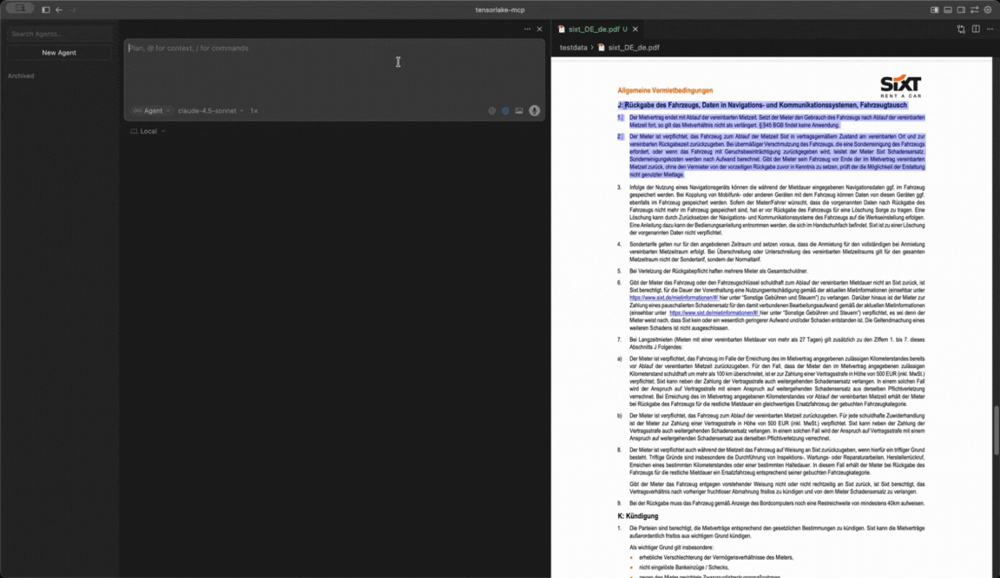

# Tensorlake MCP Server

An MCP server that provides a cloud sandbox environment for document processing. Upload documents, parse them with AI, and work with the results using familiar harness engineering tools (bash, file read/edit, grep, glob).

<a href="https://github.com/user-attachments/assets/e4818385-0f65-4b7b-9efe-8bc747e80630">
  
</a>

## Prerequisites

- A Tensorlake API key (sign up at [Tensorlake](https://tensorlake.ai))
- An MCP-compatible host application (e.g., [Claude Desktop](https://claude.ai/download), [Cursor](https://cursor.com), or other MCP hosts)

## Installation

### Install using `go install`

```bash
go install github.com/sixt/tensorlake-mcp@latest
```

Locate the binary in your `GOPATH/bin` directory:

```bash
$ which tensorlake-mcp
/Users/<username>/go/bin/tensorlake-mcp
```

### Building from Source

```bash
git clone https://github.com/sixt/tensorlake-mcp.git
cd tensorlake-mcp
go build -o tensorlake-mcp .
```

## Configuration

### Environment Variables

| Variable | Required | Default | Description |
|----------|----------|---------|-------------|
| `TENSORLAKE_API_KEY` | Yes | — | Your Tensorlake API key |
| `TENSORLAKE_API_BASE_URL` | No | `https://api.tensorlake.ai/documents/v2` | Tensorlake API base URL |
| `TENSORLAKE_SANDBOX_API_BASE_URL` | No | SDK default | Sandbox API base URL |
| `TENSORLAKE_SANDBOX_PROXY_BASE_URL` | No | SDK default | Sandbox proxy base URL |
| `TENSORLAKE_SANDBOX_TIMEOUT_SECS` | No | `3600` | Sandbox session timeout in seconds |
| `TENSORLAKE_MCP_LOG_LEVEL` | No | `debug` | Log level: `debug`, `info`, `warn` |
| `TENSORLAKE_SANDBOX_ID` | No | — | Reuse an existing sandbox instead of creating a new one |

### MCP Host Setup

#### Claude Desktop

Add to `~/Library/Application Support/Claude/claude_desktop_config.json` (macOS) or `%APPDATA%\Claude\claude_desktop_config.json` (Windows):

```json
{
  "mcpServers": {
    "tensorlake-mcp": {
      "command": "/absolute/path/to/tensorlake-mcp",
      "env": {
        "TENSORLAKE_API_KEY": "your-api-key-here",
        "TENSORLAKE_SANDBOX_API_BASE_URL": "https://api.tensorlake.ai/sandboxes",
        "TENSORLAKE_SANDBOX_PROXY_BASE_URL": "https://sandbox.tensorlake.ai"
      }
    }
  }
}
```

#### Claude Code

```bash
claude mcp add tensorlake-mcp /absolute/path/to/tensorlake-mcp \
  -e TENSORLAKE_API_KEY=your-api-key-here \
  -e TENSORLAKE_SANDBOX_API_BASE_URL=https://api.tensorlake.ai/sandboxes \
  -e TENSORLAKE_SANDBOX_PROXY_BASE_URL=https://sandbox.tensorlake.ai
```

#### Cursor

Add to `.cursor/mcp.json` in your project root:

```json
{
  "mcpServers": {
    "tensorlake-mcp": {
      "command": "/absolute/path/to/tensorlake-mcp",
      "env": {
        "TENSORLAKE_API_KEY": "your-api-key-here",
        "TENSORLAKE_SANDBOX_API_BASE_URL": "https://api.tensorlake.ai/sandboxes",
        "TENSORLAKE_SANDBOX_PROXY_BASE_URL": "https://sandbox.tensorlake.ai"
      }
    }
  }
}
```

See also: [Other MCP Clients](https://modelcontextprotocol.io/clients)

## Tools

All tools operate on a cloud sandbox filesystem. The sandbox is created lazily on first use and all files live under `/data`. The sandbox session is persisted across server restarts — if the sandbox is still running, it will be reused automatically.

The server instructs AI clients to prefer dedicated tools over bash for file operations, following harness engineering best practices.

### `bash`

Execute shell commands in the sandbox. Returns exit code, stdout, and stderr. Sends MCP progress notifications during long-running commands.

| Parameter | Type | Required | Description |
|-----------|------|----------|-------------|
| `command` | string | Yes | The shell command to execute |
| `timeout_sec` | integer | No | Timeout in seconds (max 300). Default 30 |
| `working_dir` | string | No | Working directory. Default `/data` |
| `description` | string | No | Human-readable description of what the command does |
| `run_in_background` | boolean | No | Run in background. Returns a `process_id` immediately |

### `bash_status`

Check status or retrieve results of a background bash command.

| Parameter | Type | Required | Description |
|-----------|------|----------|-------------|
| `process_id` | string | Yes | Process ID from a background bash command |

### `file_read`

Read a file from the sandbox with line numbers (cat -n format). Detects binary files, returns base64 image content for image files, and supports PDF text extraction with page ranges.

| Parameter | Type | Required | Description |
|-----------|------|----------|-------------|
| `path` | string | Yes | Absolute path to the file |
| `offset` | integer | No | 0-based line offset. Default 0 |
| `limit` | integer | No | Number of lines to read. Default 2000 |
| `pages` | string | No | PDF page range, e.g. `1-5`, `3` |

### `file_write`

Write a file to the sandbox. Creates or overwrites entirely.

| Parameter | Type | Required | Description |
|-----------|------|----------|-------------|
| `path` | string | Yes | Absolute path to the file |
| `content` | string | Yes | Full content to write |

### `file_edit`

Edit a file using exact string replacement.

| Parameter | Type | Required | Description |
|-----------|------|----------|-------------|
| `path` | string | Yes | Absolute path to the file |
| `old_string` | string | Yes | Text to find (empty to create new file) |
| `new_string` | string | Yes | Replacement text |
| `replace_all` | boolean | No | Replace all occurrences. Default false |

### `grep`

Search file contents by regex pattern. Supports multiple output modes, context lines, and case-insensitive search.

| Parameter | Type | Required | Description |
|-----------|------|----------|-------------|
| `pattern` | string | Yes | Regex pattern to search for |
| `path` | string | No | Directory to search. Default `/data` |
| `glob` | string | No | File glob filter, e.g. `*.py` |
| `output_mode` | string | No | `content` (default), `files_with_matches`, or `count` |
| `before` | integer | No | Context lines before match (-B) |
| `after` | integer | No | Context lines after match (-A) |
| `context` | integer | No | Context lines before and after (-C) |
| `ignore_case` | boolean | No | Case-insensitive search |
| `head_limit` | integer | No | Truncate output at N lines. Default 200 |

### `glob`

Find files by name pattern. Supports recursive `**` patterns. Results sorted by modification time.

| Parameter | Type | Required | Description |
|-----------|------|----------|-------------|
| `pattern` | string | Yes | Glob pattern, e.g. `*.pdf`, `**/*.py` |
| `path` | string | No | Base directory. Default `/data` |

### `upload`

Upload a file into the sandbox from a URL, local path, or data URI.

| Parameter | Type | Required | Description |
|-----------|------|----------|-------------|
| `source` | string | Yes | `https://...`, `file://...`, or `data:...` |
| `destination` | string | No | Sandbox path. Default `/data/<filename>` |

### `parse`

Parse a document using Tensorlake AI. Writes the result as markdown.

| Parameter | Type | Required | Description |
|-----------|------|----------|-------------|
| `path` | string | Yes | Path to the document in the sandbox |
| `output_path` | string | No | Output path. Default `/data/parsed/<basename>.md` |

## Example Interaction

```
User: Parse this invoice at https://example.com/invoice.pdf and find the total amount.

AI: [Uses upload to fetch the PDF into the sandbox]
    [Uses parse to extract content as markdown]
    [Uses file_read to inspect the parsed result]
    [Uses grep to search for the total amount]
    The total amount on the invoice is $1,234.56.
```

## Development

```bash
export TENSORLAKE_API_KEY="your-api-key"
go build && ./tensorlake-mcp
```

### Testing

Integration tests require a valid API key:

```bash
TENSORLAKE_API_KEY="your-api-key" go test -v ./...
```

### MCP Inspector

```bash
npx @modelcontextprotocol/inspector /absolute/path/to/tensorlake-mcp
```

## License

Copyright 2025 SIXT SE. Licensed under the Apache License, Version 2.0. See [LICENSE](LICENSE) for details.

<a href="https://www.sixt.com">
    <picture>
        <source media="(prefers-color-scheme: dark)" srcset=".github/sixt_dark.png">
        <source media="(prefers-color-scheme: light)" srcset=".github/sixt_light.png">
        
    </picture>
</a>

